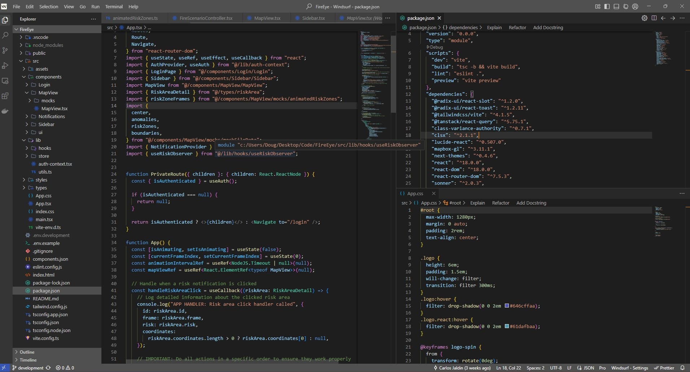

# Monokai Modern Dimmed

A custom VS Code theme that combines the modern Dark UI with Monokai Dimmed syntax highlighting for a comfortable coding experience.

## Features

- Clean, modern dark UI elements from VS Code's Dark Modern theme
- Classic Monokai Dimmed syntax highlighting that's easy on the eyes
- Carefully balanced contrast for readability during long coding sessions
- Optimized for a wide range of programming languages

## Screenshots

## Installation

1. Open **Extensions** sidebar panel in VS Code (`Ctrl+Shift+X` or `Cmd+Shift+X`)
2. Search for `Monokai Modern Dimmed`
3. Click **Install**
4. Select **Monokai Modern Dimmed** from the themes dropdown menu (`Ctrl+K Ctrl+T`)

## Feedback & Contributions

If you have suggestions or find any issues, please open an issue on the [GitHub repository](https://github.com/dougc95/monokai-modern-dimmed).

**Enjoy!**
